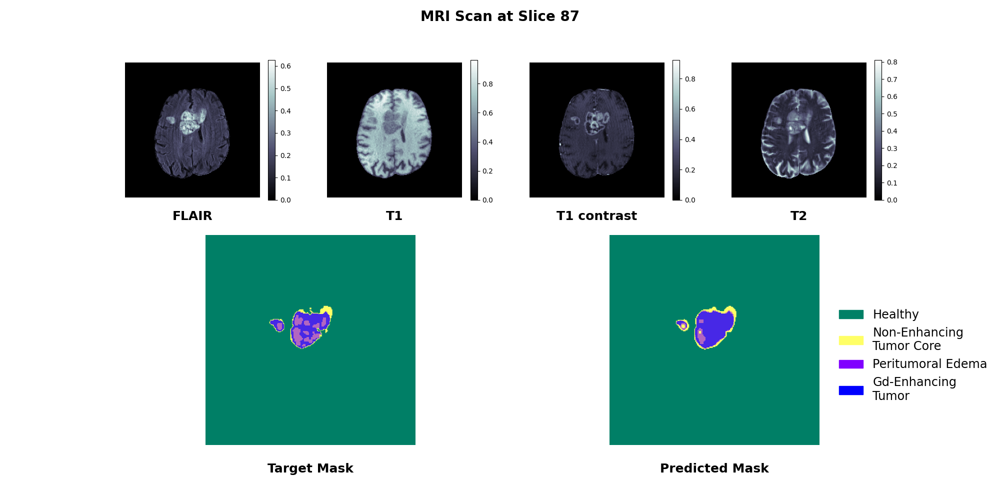
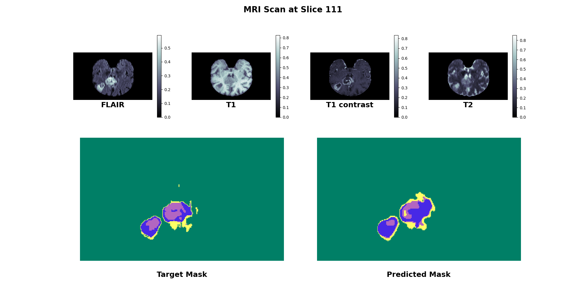
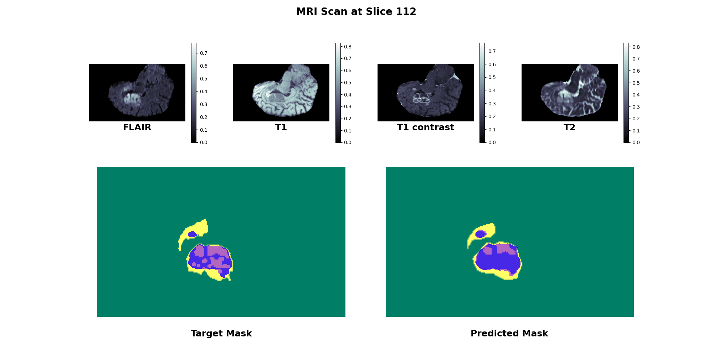

# cs231n-3d-segmentation

[Stanford CS231N Deep Learning for Computer Vision][1]: Class Project

## Summary

<a name="3d_unet_summary"></a>

### 3-D U-Net

A 3-D U-Net gets passed batches of four MRI scans (B x 4 x D x H x W),
and processes them using 3-D convolution and max pooling layers.
The idea is the model can utilize 3-D spatial information,
not just 2-D (per-slice) info.

Trained weights are available in [unet_zoo/checkpoints](unet_zoo/checkpoints).
The binary threshold used on the 3-D U-Net model's raw predictions was 0.25,
we found this maximized the [IoU](https://en.wikipedia.org/wiki/Jaccard_index)
within the validation dataset's binarized predictions and labels.

Here are several cross-sections from the test dataset's example 2:

| Angle |                                 Image                                 |
| :---: | :-------------------------------------------------------------------: |
|   0   |  |
|   1   |  |
|   2   |  |

Here is the same example rendered in 3-D.
The color code is
grey is healthy tissue,
green is non-enhancing tumor core,
blue is peritumoral edema,
and purple is Gd-enhancing tumor.

|                            Labels                             |                                    Predictions                                     |
| :-----------------------------------------------------------: | :--------------------------------------------------------------------------------: |
| .png>) | .png>) |

### 2-D U-Net

On the branch [experiment/unet2d][2], we trained a 2-D U-Net.
A 2-D U-Net gets passed batches of four MRI slices (B x 4 x H x W),
where the batch dimension B is actually the original MRI's depth dimension D.

This slicing detail effectively turns a batch of MRI volumes
into a batch of slices from MRI volumes.
This means a 2-D U-Net doesn't learn upon
data containing 3-D spatial information.
The 2-D U-Net model was trained using the slices dataset
found in [data/loaders.py](data/loaders.py).

The 2-D U-Net uses 2-D convolution and max pooling layers (as opposed to 3-D ones),
so it has 1/3rd the weights of a 3-D U-Net.
This lightweight model runs substantially faster,
but, given the same training data,
generally under-performs a 3-D U-Net when looking at IoU with labels.

Trained weights are available in
[unet_zoo/checkpoints on the experiment/unet2d branch][7].
The binary threshold used on the 2-D U-Net model's raw predictions was 0.06,
using the IoU procedure detailed in the [3-D U-Net summary](#3d_unet_summary).

Here are several cross-sections from the test dataset's example 2:

| Angle |                                 Image                                 |
| :---: | :-------------------------------------------------------------------: |
|   0   |  |
|   1   |  |
|   2   |  |

Here is the same example rendered in 3-D,
its color code corresponds with
the [3-D U-Net summary](#3d_unet_summary)'s colors.

|                            Labels                             |                                    Predictions                                     |
| :-----------------------------------------------------------: | :--------------------------------------------------------------------------------: |
| .png>) | .png>) |

## Dataset

We used the [BraTS2020 Dataset (Training + Validation)][5] dataset from Kaggle.
All iterations of the BraTS challenge can be found [here][3].

Here's how to easily download the dataset with the [Kaggle API][4]:

```console
kaggle datasets download -p data/brats2020-training-validation-data --unzip awsaf49/brats20-dataset-training-validation
```

## Development

Development began in spring 2023 using Python 3.11.

### AWS

AWS granted access to G and VT instances, and at the time,
AWS's Deep Learning AMI supported G3, P3, P3dn, P4d, P4de, G5, G4dn instances.
Thus, the AMI used was
Deep Learning AMI GPU PyTorch 2.0.0 (Ubuntu 20.04) 20230530 ([release notes][6])
with instance type `g4dn.2xlarge`
and 120 GiB of gp3 (general purpose SSD) storage.

For your reference, the below commands take less than 20 minutes to run.

Step 1: check GPU is present.

```shell
nvcc --version  # cuda_11.8
nvidia-smi  # NVIDIA Tesla T4
sudo apt update && sudo apt upgrade -y
sudo apt install -y ubuntu-drivers-common alsa-utils
ubuntu-drivers devices  # Drivers: nvidia-driver-525, nvidia-driver-525-server
```

Step 2: install and configure Python 3.11.

```shell
python3 --version  # 3.8.10
sudo apt update && sudo apt upgrade -y
sudo add-apt-repository -y ppa:deadsnakes/ppa
sudo apt install -y python3.11 python3.11-dev python3.11-venv
sudo update-alternatives --install /usr/bin/python3 python3 /usr/bin/python3.8 1
sudo update-alternatives --install /usr/bin/python3 python3 /usr/bin/python3.11 2
python3 --version  # 3.11.3
```

Step 3: `git clone` and install requirements into a `venv`.

```shell
git clone https://github.com/jamesbraza/cs231n-3d-segmentation.git
cd cs231n-3d-segmentation
python3 -m venv venv
source venv/bin/activate
python -m pip install --no-cache-dir --progress-bar off -r requirements.txt
```

Step 4: download BraTS 2020 dataset using the Kaggle API.

```shell
# Run these from local (non-VM) machine
export SEG01=<vm IP address>
scp -pr ~/.kaggle/ ubuntu@$SEG01:~/.kaggle/
ssh ubuntu@$SEG01
cd cs231n-3d-segmentation
source venv/bin/activate
kaggle datasets download -p data/brats2020-training-validation-data \
    --unzip awsaf49/brats20-dataset-training-validation
```

### TensorBoard

#### Local Training

Here is how you kick off TensorBoard:

```shell
tensorboard --logdir <path> --port 6006
```

Afterwards, go to the URL: http://localhost:6006/.

#### Remote Training

If training on a remote machine, make sure you expose port 6006
in the AWS security group:

- IP version: IPv4
- Type: Custom TCP
- Protocol: TCP
- Port range: 6006
- Source: `0.0.0.0/0`
- Description: TensorBoard

First, start TensorBoard on the remote machine:

```shell
tensorboard --logdir <path> --host 0.0.0.0 --port 6006
```

Then on the local machine:

```shell
export SEG01=<vm IP address>
python -m webbrowser http://$SEG01:6006/
# or
open http://$SEG01:6006/
```

[1]: http://cs231n.stanford.edu/
[2]: https://github.com/jamesbraza/cs231n-3d-segmentation/tree/experiment/unet2d
[3]: https://www.med.upenn.edu/cbica/brats/
[4]: https://github.com/Kaggle/kaggle-api
[5]: https://www.kaggle.com/datasets/awsaf49/brats20-dataset-training-validation
[6]: https://aws.amazon.com/releasenotes/aws-deep-learning-ami-gpu-pytorch-2-0-ubuntu-20-04/
[7]: https://github.com/jamesbraza/cs231n-3d-segmentation/tree/experiment/unet2d/unet_zoo/checkpoints
